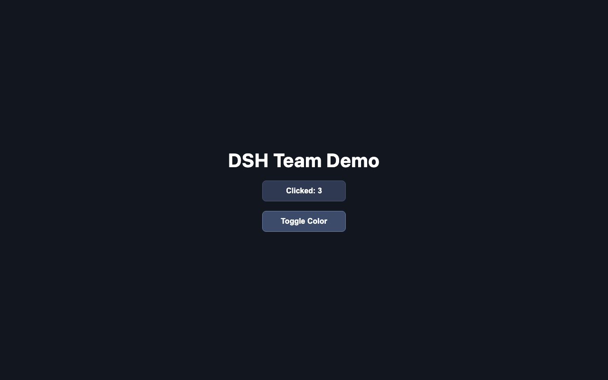
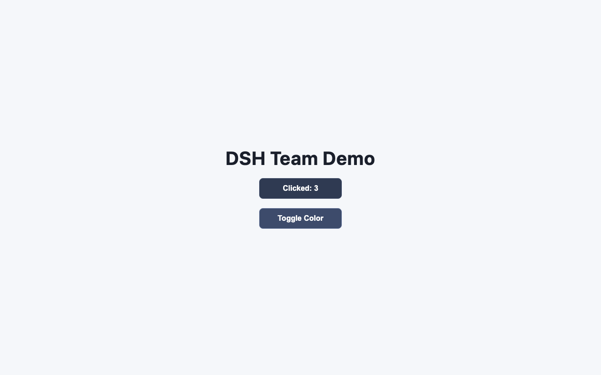

# dsh-verify

[](https://github.com/263311487-ux/dsh-verify/actions/workflows/ci.yml)

> **Agents self-test and pass. Real browsers tell the truth.**

`dsh-verify` is a tiny, dependency-light acceptance tester for **agent-delivered web artifacts**. You write a JSON spec of what a human would check in a browser; it launches a real headless Chromium, clicks, reads computed styles, and produces an HTML report plus a `0/1` exit code.

It exists because we got burned — and we have receipts.

---

## The story (why this exists)

We ran a **4-agent web team** (spec writer → frontend dev → QA → reviewer). The team shipped a demo page with a counter and a dark-mode toggle. Their own review report said:

> ✅ "All requirements met. No issues found."

In a real browser, the toggle button **did nothing** — the page background never changed. The `.dark` class was toggled by JavaScript, but the CSS rule for `.dark` was never written. Every agent self-test passed because there was nothing in the page for the agents to run. **No one opened a real browser.**

That is the gap: *agents verify against what they believe they built, not against what a user actually experiences.* Unit tests and static checks can't catch a missing CSS rule.

This repo contains the bug, fixed, side by side — and the browser-driven evidence that separates them:

| Build | What the agents said | What a real browser says |
|---|---|---|
| `demo/buggy` | "No issues found" | ❌ FAIL — background never changes |
| `demo/fixed` | one CSS rule added | ✅ PASS — theme flips |

Same page. Same JS. One missing CSS rule. Two different verdicts.

---

## What it does

- Reads a **JSON spec** (no framework, no config language)
- Serves your static directory (or points at any URL)
- Drives a **real headless Chromium** (Playwright)
- Checks what humans check: text, classes, **computed styles**, URLs
- Emits a self-contained **HTML report** with screenshots
- Exits `0` on pass, `1` on fail → drop it into any CI

## Quick start

```bash
npm install
npx playwright install chromium   # one-time browser download

# Run the two demo specs back to back
npm run demo:buggy                # → FAIL (exit 1) — missing .dark style caught
npm run demo:fixed                # → PASS (exit 0)

# engine self-tests + full CI flow
npm test                          # node:test suite
npm run ci                        # tests + fixed PASS + buggy FAIL (as proof of detection)
```

The repo's own CI runs exactly that: engine self-tests, then asserts the fixed build **passes** and the buggy build **fails** — so the tool verifies itself on every push (`.github/workflows/ci.yml`).

### Machine-readable output

```bash
node bin/verify.mjs --spec demo/fixed.json --out /tmp/out --json
# {"verdict":"PASS","passed":11,"total":11,"failed":[],"report":"/tmp/out/report.html"}
```

## Running many specs

```bash
node bin/verify.mjs --spec 'specs/*.json' --out reports/
# [PASS] specs/home.json (5/5)
# [FAIL] specs/cart.json (4/5)
#   ❌ expect_text #total: got "0" want "99"
```

Each spec gets its own `reports/<name>/` folder; exit is `0` only if **all** pass.

## Spec format

```json
{
  "title": "my acceptance check",
  "serve": "demo/fixed",
  "steps": [
    { "action": "goto", "path": "/index.html" },
    { "action": "click", "selector": "#count-btn", "count": 3 },
    { "action": "expect_text", "selector": "#count-btn", "text": "Clicked: 3" },
    { "action": "capture_style", "selector": "#page", "prop": "backgroundColor", "var": "bg_before" },
    { "action": "click", "selector": "#color-btn" },
    { "action": "expect_class", "selector": "#page", "class": "dark", "present": true },
    { "action": "expect_style_changed", "selector": "#page", "prop": "backgroundColor", "var": "bg_before" },
    { "action": "screenshot", "name": "final-state" }
  ]
}
```

### Actions

| Action | Fields | What it verifies |
|---|---|---|
| `goto` | `path` / `url` | Navigate (uses the served dir if `serve` is set) |
| `wait` | `ms` | Wait (lets CSS transitions settle) |
| `click` | `selector`, `count?` | Click an element, N times |
| `fill` | `selector`, `text` | Fill an input |
| `expect_text` | `selector`, `text`, `exact?` | Visible text contains/equals target |
| `expect_class` | `selector`, `class`, `present?` | Class is present (default) or absent |
| `capture_style` | `selector`, `prop`, `var` | Snapshot a **computed style** into a variable |
| `expect_style_changed` | `selector`, `prop`, `var` | Computed style differs from the snapshot — the check that catches "class toggled but CSS never written" |
| `expect_url_contains` | `text` | Current URL contains target |
| `expect_navigation` | `to`, `timeout?` | Wait until the URL contains `to` (e.g. after clicking a link) |
| `expect_console_errors` | `present?` | No console errors during the run (default: expect none) |
| `expect_network_errors` | `present?` | No 4xx/5xx responses or failed requests (default: expect none) |
| `screenshot` | `name`, `full?` | Save a PNG into the report |

The `capture_style` → `expect_style_changed` pair is the heart of this project: it verifies **what the user sees**, not what the DOM class list says.

## Live evidence

The two screenshots below are real output from `dsh-verify` against the two builds of the same demo (Chromium, 1280×800, after clicking the toggle):

Buggy build — toggle clicked, background unchanged:


Fixed build — toggle clicked, theme flipped:


Full step-by-step reports: [buggy report](evidence/buggy-report.html) · [fixed report](evidence/fixed-report.html).

## Docker (pinned Chromium)

```bash
docker build -t dsh-verify .
docker run --rm -v "$PWD:/app" dsh-verify --spec demo/fixed.json --out /app/reports
```

Uses `mcr.microsoft.com/playwright:v1.62.1-jammy` so the Chromium build matches the Playwright version — no browser download at image build time. (Built and documented; verified locally, not on a Docker host yet.)

## Why nothing else does this

We researched the agent-tooling community before building. Existing "verification" for agent deliverables is mostly:
- **Plugin/install smoke checks** — does a skill install, does a CLI exist (e.g. plugin-discovery tools).
- **Static lint / unit tests** — validate the code the agent wrote, not the behavior the user experiences.
- **Screenshot-only agents** — look at a picture, don't *assert* behavior.

None of them run a real browser against the artifact and answer: *"When I click this button, does the user see the change?"* That is the niche `dsh-verify` fills — deliberately small, no framework, JSON spec in, browser verdict out.

## Roadmap

- [x] `expect_console_errors` / `expect_network_errors` — no console errors, no 4xx/failed requests
- [x] `--json` verdict output for CI logs; failed steps printed to stdout
- [x] Multi-page flows and `expect_navigation` (wait for URL after click)
- [x] `--spec` glob (run many specs, one aggregated verdict)
- [x] Docker image with pinned Chromium (`mcr.microsoft.com/playwright:v1.62.1-jammy`)

## License

MIT
